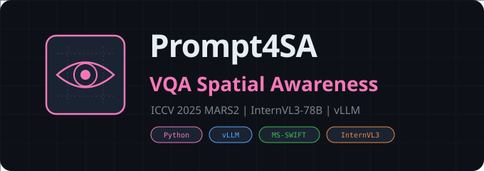

<div align="center">



<br/>
<br/>

**Simple Prompting for Spatial Awareness**

*ICCV 2025 MARS2 Workshop -- VQA-SA 赛道*

[](https://www.python.org/)
[](https://docs.vllm.ai/)
[](https://github.com/modelscope/ms-swift)
[]()

</div>

---

## 概述

ICCV 2025 MARS2 Workshop VQA-SA（Visual Question Answering with Spatial Awareness）赛道的参赛代码。使用 InternVL3-78B 多模态大模型，通过 MS-SWIFT + vLLM 推理引擎进行空间感知视觉问答。

### 赛道背景

- **Workshop**: Multimodal Reasoning and Slow Thinking in Large Model Era (System 2)
- **赛道**: VQA-SA -- 评测空间/常识/反事实推理能力
- **模型**: InternVL3-78B（多模态视觉语言模型）

---

## 项目结构

```
Prompt4SA/
├── main.py                  # 批量推理与可视化主脚本
├── src/
│   └── NotoSansSC-Regular.otf  # 中文可视化字体
├── model/
│   └── README.md            # 模型权重放置说明
├── data/                    # 本地数据（不提交）
│   ├── images/              # 图像文件夹
│   └── VQA-SA-question.json # 评测问题文件
├── requirements.txt         # 依赖
└── run.sh                   # 运行脚本
```

---

## 环境准备

### 要求

| 要求 | 说明 |
|:---|:---|
| 系统 | Linux |
| Python | >= 3.10 |
| CUDA | 与 PyTorch/vLLM 版本匹配 |
| GPU | 多卡推荐（78B 模型） |

### 安装

```bash
conda create -n mars2-vqa python=3.10 -y
conda activate mars2-vqa
pip install -r requirements.txt
```

> MS-SWIFT 官方推荐 `vllm==0.8.5.post1`，本仓库已固定该版本。

---

## 数据与模型

**数据**（本地放置，不提交仓库）：
- 图像目录：`data/images/`
- 问题文件：`data/VQA-SA-question.json`

**模型权重**：修改 `main.py` 顶部的 `MODEL_PATH` 常量指向本地 InternVL3-78B 权重路径。

---

## 运行

```bash
conda activate mars2-vqa
bash run.sh
# 或直接执行
CUDA_VISIBLE_DEVICES=0,1,2,3 python main.py
```

输出：
- `VQA-SA-results.json` -- 聚合结果
- `InternVL3-output/` -- 可视化 PNG

---

## 提交到 EvalAI（可选）

```bash
pip install evalai
printf "n\n" | evalai challenge 2552 phase 5069 submit \
  --file VQA-SA-results.json --large --public
```

或在 `main.py` 中设置 `SUBMIT_TO_EVALAI=True` 自动提交。

---

## 复现清单

- [ ] 创建 `data/images/` 与 `data/VQA-SA-question.json`
- [ ] 确保 JSON 中 `image_path` 与本地路径匹配
- [ ] 准备模型权重并设置 `MODEL_PATH`
- [ ] 创建 Conda 环境并安装依赖
- [ ] 运行 `bash run.sh` 或 `python main.py`
- [ ] 检查 `VQA-SA-results.json` 与可视化输出
- [ ] （可选）安装 `evalai` 并提交评测

---

## 致谢

- [MS-SWIFT](https://github.com/modelscope/ms-swift) + [vLLM](https://docs.vllm.ai/) 推理引擎
- MARS2 组委会与 ICCV 2025 Workshop 提供数据与赛题
